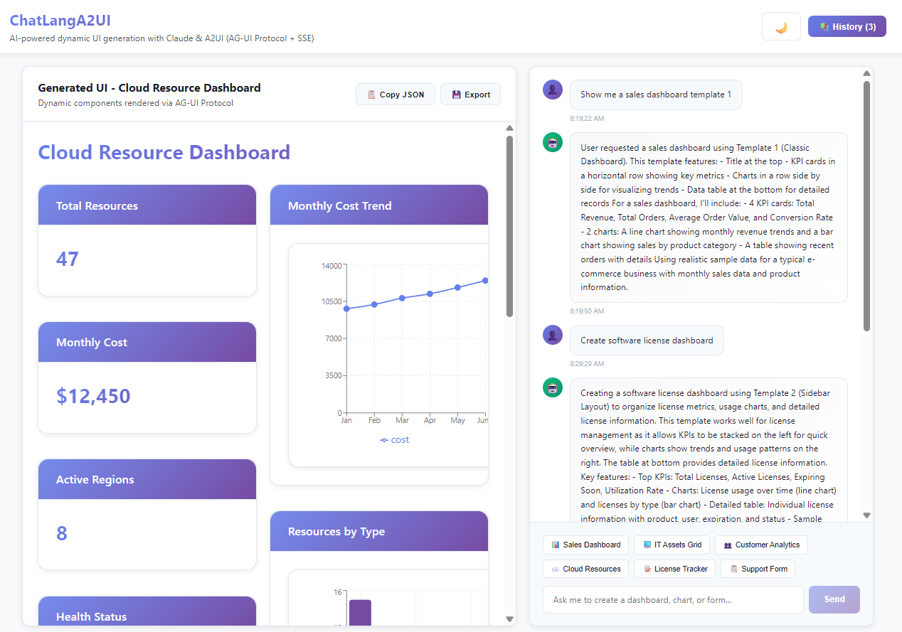
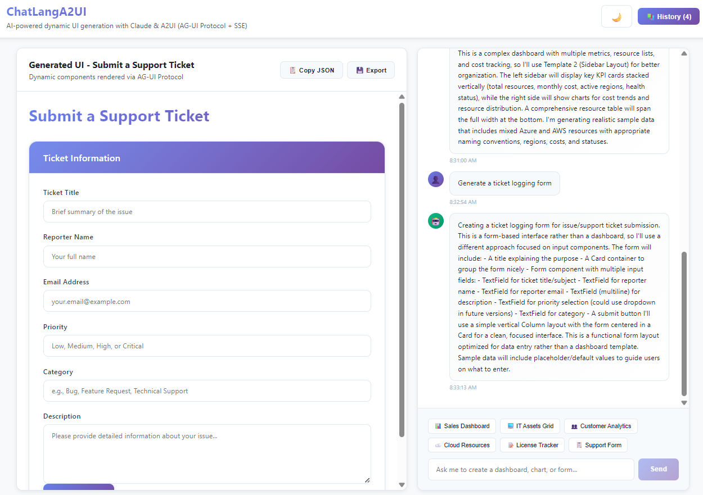

# ChatLangA2UI

A proof-of-concept chat application demonstrating the integration of CopilotKit, LangChain agents, and A2UI for dynamic UI generation powered by Claude LLM.

## Overview

This project showcases how LLMs can generate dynamic user interfaces in real-time through natural language interactions. The system uses:

- **Frontend**: React with CopilotKit supporting AG-UI and A2UI protocols
- **Backend**: Python FastAPI orchestrator with LangGraph agents
- **LLM**: Claude Sonnet 4.5 with structured outputs
- **Dynamic UI**: A2UI components (tables, charts, forms, dashboards) generated by the LLM

Generate forms, dashboards and dynamic widgets.
Content is generated by the LLM for this POC. It can be replaced with your real logic and content generator paired with a LLM.


History in the current session


Streaming protocol message can be seen in the Inspector / Network / EventStream.
THis can be anhanced with a lot more event type. See the AG-UI protocol documentation for more.


## Architecture

```
┌─────────────────────────────────────────────────────────┐
│  Frontend (React + CopilotKit)                          │
│  - Chat interface                                        │
│  - A2UI component renderer                              │
│  - AG-UI protocol client                                │
└───────────────────┬─────────────────────────────────────┘
                    │ AG-UI Protocol (HTTP/SSE)
┌───────────────────▼─────────────────────────────────────┐
│  Backend (FastAPI + LangGraph)                          │
│  - CopilotKit endpoint                                  │
│  - LangGraph agent orchestrator                         │
│  - Claude LLM with structured outputs                   │
│  - A2UI JSONL generation                                │
└─────────────────────────────────────────────────────────┘
```

## Features

- **Natural Language UI Generation**: Ask for dashboards, charts, tables, or forms in plain English
- **Multiple Specialized Agents**:
  - Dashboard Agent: Creates comprehensive dashboards with KPIs and metrics
  - Data Visualization Agent: Generates charts (line, bar, pie, area)
  - Form Agent: Creates interactive forms with validation
- **Real-time Streaming**: A2UI components stream to the frontend as they're generated
- **Configuration-based**: Prompts and agent definitions in YAML/Markdown files

## Prerequisites

- **Python 3.10-3.12** (tested with 3.13, but 3.10-3.12 recommended for CopilotKit compatibility)
- **Node.js 18+** with npm
- **Anthropic API Key** (Claude access)

## Setup Instructions

### 1. Clone the Repository

```bash
cd C:\Projects\ChatLangA2UI
```

### 2. Backend Setup

```bash
# Navigate to backend directory
cd backend

# Create virtual environment
python -m venv venv

# Activate virtual environment
# Windows (Command Prompt):
venv\Scripts\activate
# Windows (PowerShell):
.\venv\Scripts\Activate.ps1

# Install dependencies
pip install -r requirements.txt

# Create .env file
copy .env.example .env

# Edit .env and add your Anthropic API key
# ANTHROPIC_API_KEY=sk-ant-...
```

### 3. Frontend Setup

```bash
# Navigate to frontend directory
cd ..\frontend

# Install dependencies
npm install

# Create .env file (optional - defaults to localhost:8123)
copy .env.example .env
```

### 4. Running the Application

#### Terminal 1 - Start Backend

```bash
cd backend
venv\Scripts\activate  # Activate virtual environment
python -m app.main
```

Backend will start on `http://localhost:8123`

#### Terminal 2 - Start Frontend

```bash
cd frontend
npm run dev
```

Frontend will start on `http://localhost:5173`

Open your browser to `http://localhost:5173`

## Usage Examples

Once both servers are running, try these natural language queries in the chat:

### Sales Dashboards
- "Show me a sales dashboard with revenue and top products"
- "Create a quarterly performance dashboard"
- "Build a KPI dashboard with revenue, users, and conversion metrics"

### Data Visualizations
- "Create a line chart showing monthly revenue trends"
- "Generate a bar chart comparing product sales"
- "Show me a pie chart of customer segments"

### Interactive Forms
- "Generate a user registration form"
- "Create a contact form with name, email, and message"
- "Build a survey form with multiple fields"

### Mixed Dashboards
- "Create a customer analytics dashboard with charts, tables, and filters"
- "Build a financial overview with graphs, KPI cards, and action buttons"
- "Generate an admin panel with user table, stats charts, and add user form"

## Project Structure

```
ChatLangA2UI/
├── backend/
│   ├── app/
│   │   ├── main.py                      # FastAPI app + CopilotKit endpoint
│   │   ├── agents/                      # LangGraph agent implementations
│   │   │   ├── base_agent.py            # Agent factory
│   │   │   ├── dashboard_agent.py
│   │   │   ├── data_viz_agent.py
│   │   │   └── form_agent.py
│   │   ├── schemas/
│   │   │   ├── a2ui_models.py           # A2UI Pydantic models
│   │   │   └── agent_config.py
│   │   ├── prompts/                     # YAML prompt templates
│   │   │   ├── dashboard_generation.yaml
│   │   │   ├── chart_generation.yaml
│   │   │   └── form_generation.yaml
│   │   └── utils/
│   │       ├── a2ui_builder.py          # JSONL builder utilities
│   │       └── prompt_loader.py
│   ├── configs/
│   │   ├── agents/                      # Markdown agent definitions
│   │   └── catalog/                     # Component catalog
│   └── requirements.txt
│
├── frontend/
│   ├── src/
│   │   ├── App.tsx                      # CopilotKit provider
│   │   ├── main.tsx                     # Entry point
│   │   ├── components/
│   │   │   ├── ChatInterface.tsx        # Chat UI
│   │   │   └── A2UIRenderer/            # A2UI rendering system
│   │   │       ├── index.tsx            # JSONL parser
│   │   │       ├── ComponentRegistry.tsx # Component mapping
│   │   │       ├── types.ts             # TypeScript types
│   │   │       └── components/          # React components
│   │   │           ├── A2UIText.tsx
│   │   │           ├── A2UIButton.tsx
│   │   │           ├── A2UICard.tsx
│   │   │           ├── A2UITable.tsx
│   │   │           ├── A2UIChart.tsx
│   │   │           ├── A2UIForm.tsx
│   │   │           └── A2UITextField.tsx
│   │   └── styles/
│   │       └── a2ui-theme.css           # Component styling
│   └── package.json
│
└── README.md
```

## Technology Stack

### Backend
- **FastAPI**: Modern Python web framework
- **LangGraph**: Graph-based agent framework
- **LangChain**: LLM orchestration
- **Claude (Anthropic)**: LLM with structured outputs
- **CopilotKit Python SDK**: AG-UI protocol implementation
- **Pydantic**: Data validation and schema definition

### Frontend
- **React 18**: UI framework
- **TypeScript**: Type-safe development
- **Vite**: Build tool and dev server
- **CopilotKit React**: Chat UI and AG-UI client
- **Recharts**: Chart library
- **TanStack Table**: Table library

### Protocols
- **AG-UI**: Runtime communication protocol (transport layer)
- **A2UI v0.8**: Declarative UI specification (payload format)
- **JSONL**: Line-delimited JSON for streaming messages

## A2UI Message Format

A2UI messages follow a sequence pattern:

1. **surfaceUpdate**: Defines all components and their structure
2. **dataModelUpdate**: Provides data for components (can be multiple)
3. **beginRendering**: Signals that rendering should start

Example:
```jsonl
{"surfaceUpdate": {"surfaceId": "main", "components": [...]}}
{"dataModelUpdate": {"surfaceId": "main", "path": "/data", "contents": [...]}}
{"beginRendering": {"surfaceId": "main"}}
```

## Configuration

### Backend Environment Variables

```env
ANTHROPIC_API_KEY=sk-ant-...          # Your Claude API key
PORT=8123                              # Backend server port
CORS_ORIGINS=http://localhost:5173     # Frontend URL for CORS
```

### Frontend Environment Variables

```env
VITE_BACKEND_URL=http://localhost:8123  # Backend API URL
```

## Customization

### Adding New Agents

1. Create agent definition in `backend/configs/agents/your_agent.md`
2. Create prompt template in `backend/app/prompts/your_prompt.yaml`
3. Create agent file in `backend/app/agents/your_agent.py`
4. Register in `backend/app/main.py`

### Adding New Components

1. Define Pydantic model in `backend/app/schemas/a2ui_models.py`
2. Create React component in `frontend/src/components/A2UIRenderer/components/`
3. Add type to `frontend/src/components/A2UIRenderer/types.ts`
4. Register in `frontend/src/components/A2UIRenderer/ComponentRegistry.tsx`

## Troubleshooting

### Backend won't start
- Check Python version: `python --version` (should be 3.10-3.12)
- Verify API key is set in `.env`
- Ensure virtual environment is activated
- Try reinstalling dependencies: `pip install -r requirements.txt --force-reinstall`

### Frontend won't connect to backend
- Verify backend is running on port 8123
- Check browser console for CORS errors
- Ensure `VITE_BACKEND_URL` in frontend `.env` matches backend URL
- Try clearing browser cache

### A2UI components not rendering
- Check browser console for errors
- Verify A2UI message format in network tab
- Ensure backend is generating valid JSONL
- Check ComponentRegistry for missing component mappings

### Python version compatibility
If you encounter issues with Python 3.13:
1. Install Python 3.12 from [python.org](https://python.org)
2. Create new virtual environment: `py -3.12 -m venv venv`
3. Reinstall dependencies

## Demo Video (Future)

*Coming soon: Screen recording demonstrating all features*

## Next Steps

- Add persistent memory (database for conversations)
- Implement action handlers (button clicks, form submissions)
- Add authentication and multi-user support
- Deploy to cloud (AWS, Azure, GCP)
- Add more component types (maps, calendars, file uploads)
- Implement real-time collaboration

## License

MIT License - See LICENSE file for details

## Contributing

This is a proof-of-concept project. Contributions, issues, and feature requests are welcome!

## Acknowledgments

- [Anthropic](https://anthropic.com) for Claude LLM
- [CopilotKit](https://copilotkit.ai) for AG-UI implementation
- [Google](https://google.github.io/applied-ai/) for A2UI protocol specification
- [LangChain](https://langchain.com) for agent orchestration
